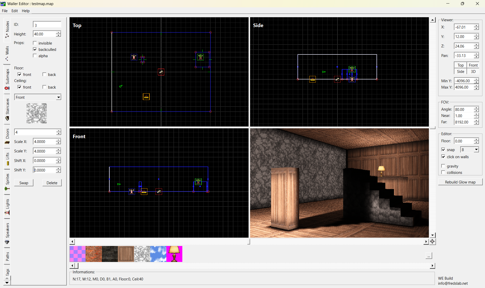
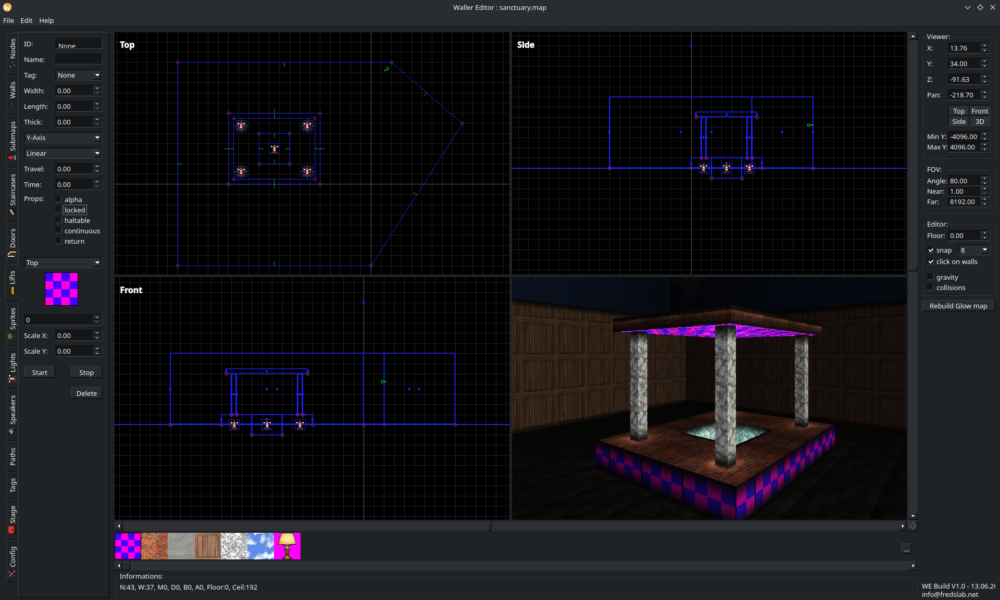

# DIE Engine & Waller

Hello, I'm Fred ;-)

You probably know me from my synthesizer work. But I always wanted to be a game dev, and I'm not getting
any younger, so here we are!

This repository is my attempt to give the community of hobby developers a basic but fully functional toolkit
for building 2.5D games.





## What's inside

- **DIE** : the renderer and runtime, in `common/engine`.
- **Waller** : the map editor, in `editor/`.  

Waller is the real strength of the toolkit: a full Qt-based level editor for building maps for the engine.

## The renderer

The renderer is sorta unique. It's software-based and works a bit like a futuristic raycaster,
I'm writing a paper about it to describe its inner in more details.

Also, it's not yet fully portable, since a lot of the core rendering code relies on SSE4 arithmetic.
That said, it shouldn't be too hard to make a portable version with the tools available today.

## A weird codebase

This codebase ranges from pure SSE intrinsics for rasterizing, to fairly advanced C++ with seamless
multithreading. It's a strange mix, of modern and retro tech, what I personally love and hopefully
a good mix!

## Building

Waller (and the engine) is built on **Qt 6** (Community/Open Source Edition), using the `core`, `gui`,
`widgets` and `spatialaudio` modules, with a C++17, SSE4-capable compiler. All four of these modules
are available under the **LGPLv3** in the Community/Open Source edition, so they're free to use here
even though this project itself is MIT licensed.

### Windows

Grab the [Qt Online Installer](https://www.qt.io/download-qt-installer-oss) and install Qt 6 with a
MinGW (or LLVM-MinGW) kit. Then just open `editor/waller.pro` in Qt Creator, pick that kit, and build.

> If you also have MSYS2 installed, make sure Qt's own MinGW/LLVM-MinGW `bin` folder (e.g.
> `C:\Qt\Tools\llvm-mingw1706_64\bin`) comes first in your `PATH` — mixing MSYS2's toolchain in will
> break the link with libstdc++/libc++ ABI mismatches.

### Linux

Install Qt 6 development packages (base, widgets and multimedia/spatial audio) plus a C++ toolchain:

- **Ubuntu / Debian**:
  ```
  sudo apt install qt6-base-dev qt6-multimedia-dev qmake6 build-essential
  ```
- **Fedora**:
  ```
  sudo dnf install qt6-qtbase-devel qt6-qtmultimedia-devel gcc-c++ make
  ```

These give you everything needed to build from the command line. If you'd rather use the Qt Creator
IDE, also install `qtcreator` (Ubuntu/Debian) or `qt-creator` (Fedora).

### All platforms

Open `editor/waller.pro` (in Qt Creator, or via `qmake`/`qmake6` followed by `make`/`mingw32-make`),
pick a kit using GCC, Clang or MinGW, and compile.

Bob's your uncle!

## Documentation

[`MANUAL.md`](MANUAL.md) describes how the renderer works: the basic objects (nodes, walls, sprites,
lights, doors, lifts...), lighting, fog and post effects.

The Doxygen-generated API reference lives in [`docs/`](docs/index.html) and can be viewed online at
[marzac.github.io/die](https://marzac.github.io/die/).

To regenerate it yourself, run `doxygen Doxyfile` from the `docs/` folder.

## License

This project is **MIT licensed**
=> I don't expect anything in return. I'm using it myself for my in-development indy game.

Feel free to fork it, have a go, build your own game with it, and have a blast.
Just don't forget to credit my work ;-)

## A personal note

Never forget this is a hobby project for me. It's over two years of spare-time work,
mostly to disconnect from the harder sides of life.

Hope you'll love it and have fun.

Take care, greetings from Bonn / Germany.

Fred.
